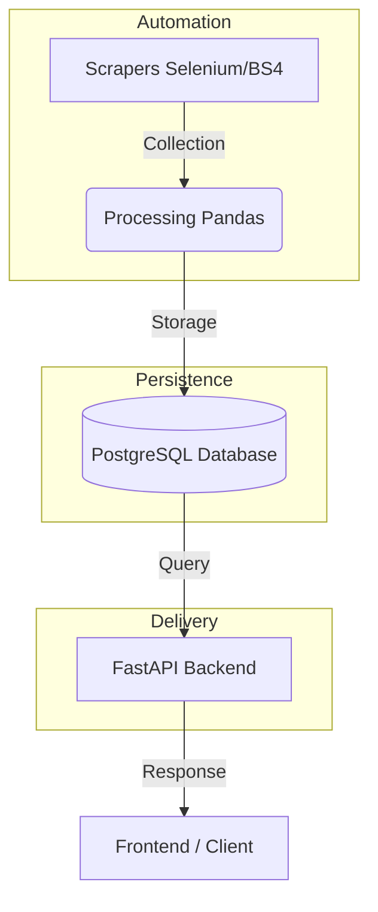

# NBA Stats API

A high-performance API for NBA statistics, designed for analysts, developers, and data enthusiasts. This platform automates data collection (scraping), processing, and delivery through a modern RESTful interface.

---

## Technical Workflow and Architecture

The project follows a cyclic data flow where automation is the core:



---

## Technologies and Libraries

### Backend Framework
- **FastAPI**: High-performance asynchronous web framework.
- **SQLAlchemy**: ORM for PostgreSQL database management.
- **Pydantic**: Data validation and schema management.
- **Uvicorn**: ASGI server for production deployment.

### Data Acquisition (Scraping)
- **Selenium**: Browser automation for capturing dynamic data.
- **BeautifulSoup4**: HTML structure analysis for precise extraction.
- **Webdriver Manager**: Automatic Chrome driver management.

### Data Processing
- **Pandas**: DataFrame manipulation and statistical data cleaning.
- **NumPy**: Advanced numerical operations.

### Security and Performance
- **Supabase JWT**: Authentication for web-based users.
- **Redis**: Caching system and dynamic Rate Limiting control.
- **Python-dotenv**: Environment variable management.

---

## Project Directory Structure

The project is organized following a clean architecture pattern:

### Root Directory
- **Dockerfile**: Defines the containerized environment for the application.
- **docker-compose.yml**: Orchestrates the API, Database, and Redis services.
- **requirements.txt**: Comprehensive list of Python dependencies.
- **ca.pem**: CA certificate for secure database connections.
- **README.md**: Main project documentation.

### Application Core (app/)
- **main.py**: Entry point of the FastAPI application. Initializes middleware, routers, and lifespan events.

#### app/api/
- **v1/router.py**: Centralized router that aggregates all version 1 endpoints.
- **v1/endpoints/**: Implementation of specific API routes.
    - **teams.py**: Endpoints for team information and listings.
    - **players.py**: Endpoints for player profiles and statistical history.
    - **games.py**: Endpoints for game results and detailed boxscores.
    - **stats.py**: Endpoints for advanced team rankings and seasonal metrics.
    - **datasets.py**: Endpoints for bulk data export (ML-ready).
    - **users.py**: User profile and API key management.
    - **subscriptions.py**: Subscription tier and billing logic.
    - **webhooks.py**: Handlers for external service notifications (e.g., payment status).
    - **logs.py**: Access to API usage logs for the authenticated user.

#### app/core/
- **database.py**: Connection pooling and SQLAlchemy engine configuration.
- **rate_limiter.py**: Logic for tier-based request throttling using Redis.
- **middleware.py**: Custom interceptors for logging, security headers, and request tracking.
- **security.py**: Utility functions for JWT verification and API key hashing.
- **supabase_auth.py**: Integration with Supabase Authentication service.
- **subscription_service.py**: Business logic for managing user tiers and limits.

#### app/models/
SQLAlchemy models defining the PostgreSQL schema:
- **team.py**, **player.py**, **game.py**: Core NBA entities.
- **player_game_stats.py**, **team_game_stats.py**: Flat tables for performance metrics.
- **player_prop.py**: Betting lines and casino statistics.
- **user.py**, **api_key.py**, **subscription_plan.py**: Platform management entities.

#### app/schemas/
Pydantic schemas for request validation and response serialization:
- **team.py**, **player.py**, **game.py**: Data structures for core entities.
- **boxscore.py**: Composite schema for full game reports.
- **datasets.py**: Flat structures optimized for data analysis.

#### app/scrappers/
The data engine of the project:
- **main.py**: Orchestrator that runs scrapers in the correct sequence.
- **schedule.py**: Retrieves the season calendar (past and future games).
- **game_player_stats.py**: Navigates through boxscores to extract detailed player metrics.
- **player_props.py**: Scrapes betting lines (Over/Under) for scheduled games.
- **insert_tables.py**: Processes raw data using Pandas and performs bulk database inserts.

---

## Data Acquisition Engine (Scrapers)

The scrapers are designed to handle both historical data and real-time daily updates:

1. **Schedule Scraper**: Fetches the league calendar, identifying completed games (historical) and upcoming matchups (daily).
2. **Performance Scraper**: The most comprehensive tool. It parses game boxscores to extract every statistical category available for every participating player.
3. **Betting Scraper**: Collects "Casino Lines" or Player Props for upcoming games, allowing for analysis between projected lines and actual performance.

---

## API Endpoints Overview

### Teams and Players
- `GET /api/v1/teams/`: List all 30 NBA teams.
- `GET /api/v1/teams/{team_id}`: Retrieve detailed information for a specific team.
- `GET /api/v1/teams/{team_id}/games`: List all games for a specific team.
- `GET /api/v1/players/`: Search players by name, team, or position.
- `GET /api/v1/players/{player_id}`: Retrieve detailed profile for a specific player.
- `GET /api/v1/players/{player_id}/games`: Retrieve historical performance data for a specific player.

### Games and Boxscores
- `GET /api/v1/games/`: Filterable list of games by date or season.
- `GET /api/v1/games/{game_id}`: Get basic metadata and score for a specific game.
- `GET /api/v1/games/{game_id}/team-stats`: Advanced team-level metrics for a specific game.
- `GET /api/v1/games/{game_id}/player-stats`: Detailed statistics for every player in a specific game.
- `GET /api/v1/games/{game_id}/boxscore`: Comprehensive report including team totals and player statistics.

### Advanced Analytics
- `GET /api/v1/stats/teams`: Aggregated rankings by season and game type.
- `GET /api/v1/datasets/player-game-stats`: Large-scale player data retrieval for machine learning pipelines.
- `GET /api/v1/datasets/team-game-stats`: Large-scale team data retrieval for machine learning pipelines.

---

## Authentication and Usage Limits

The API implements a tier-based Rate Limiting system:

- **Free Tier**: 10 req/min, 100 req/hour, 1,000 req/day.
- **Premium Tier**: 100 req/min, 1,000 req/hour, 10,000 req/day.
- **Pro Tier**: 1,000 req/min, 10,000 req/hour, 100,000 req/day.

### Security Methods
- **JWT Authentication**: Primarily for the web dashboard.
- **X-API-Key**: Header-based authentication for programmatic access and external scripts.

---

## Installation and Setup

1. **Clone the repository**:
   ```bash
   git clone https://github.com/user/nba-stats-api.git
   ```

2. **Install dependencies**:
   ```bash
   pip install -r requirements.txt
   ```

3. **Configure environment**:
   Create a `.env` file based on the provided configuration for PostgreSQL, Supabase, and Redis.

4. **Launch the application**:
   ```bash
   python -m app.main
   ```
